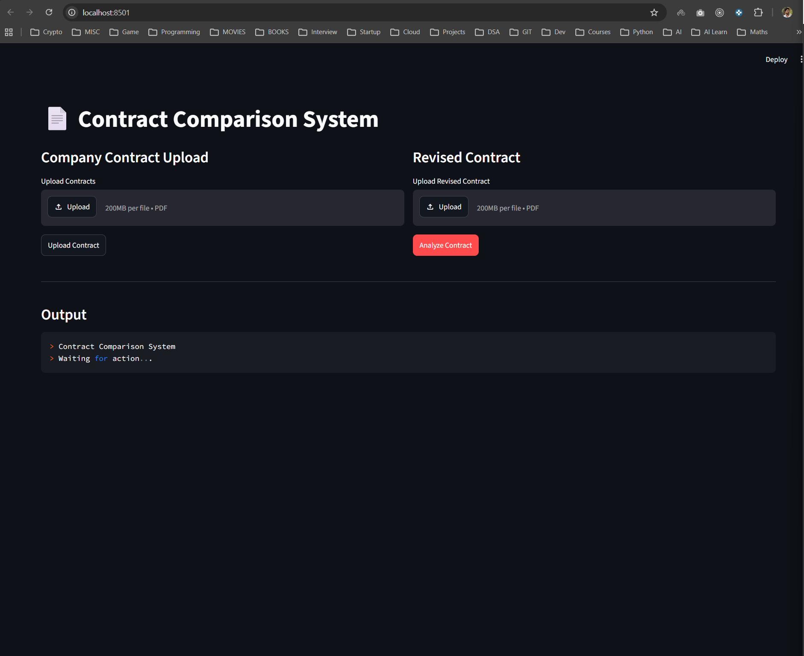
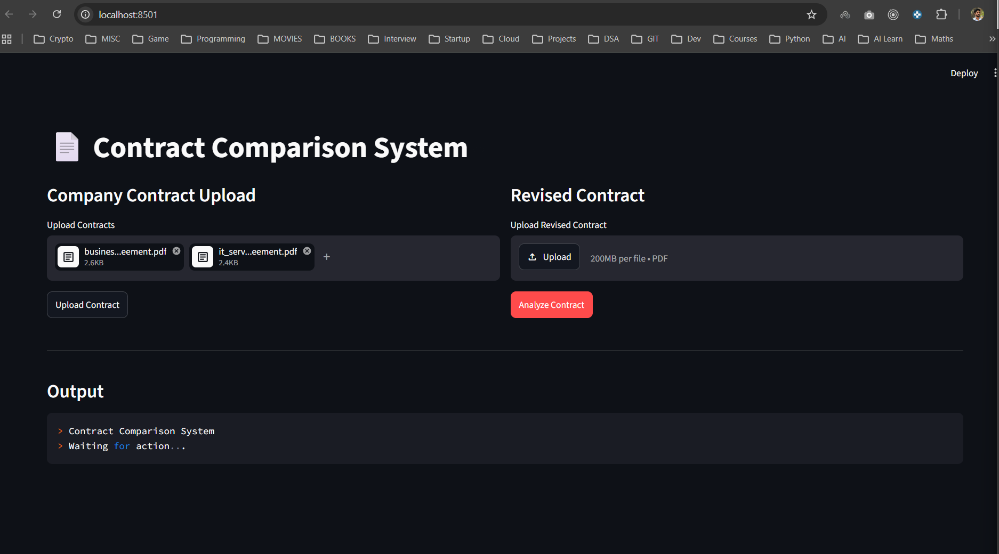
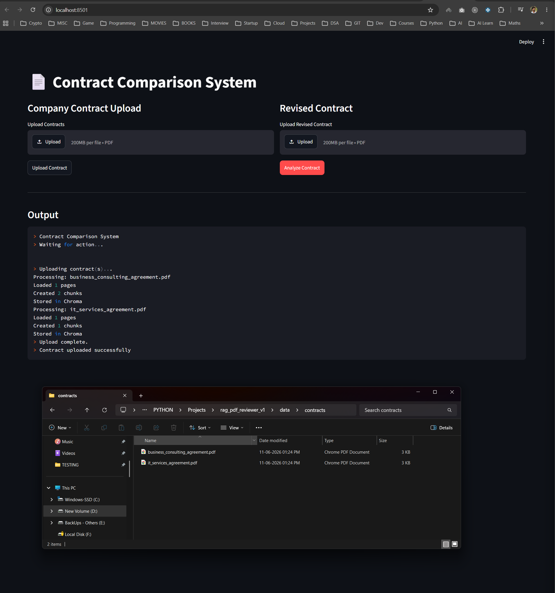
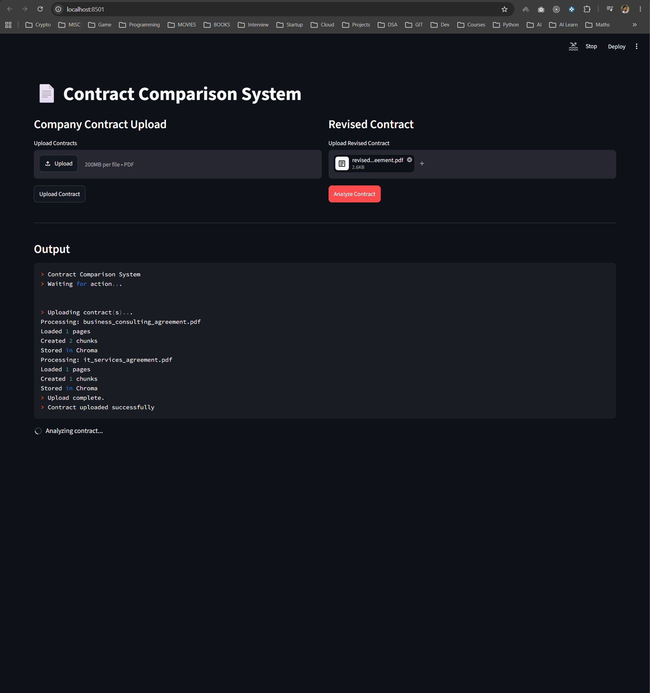
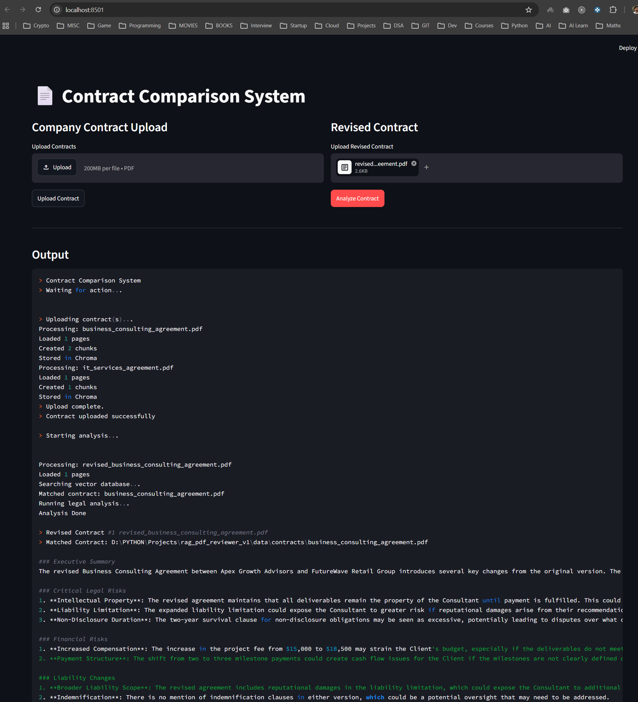
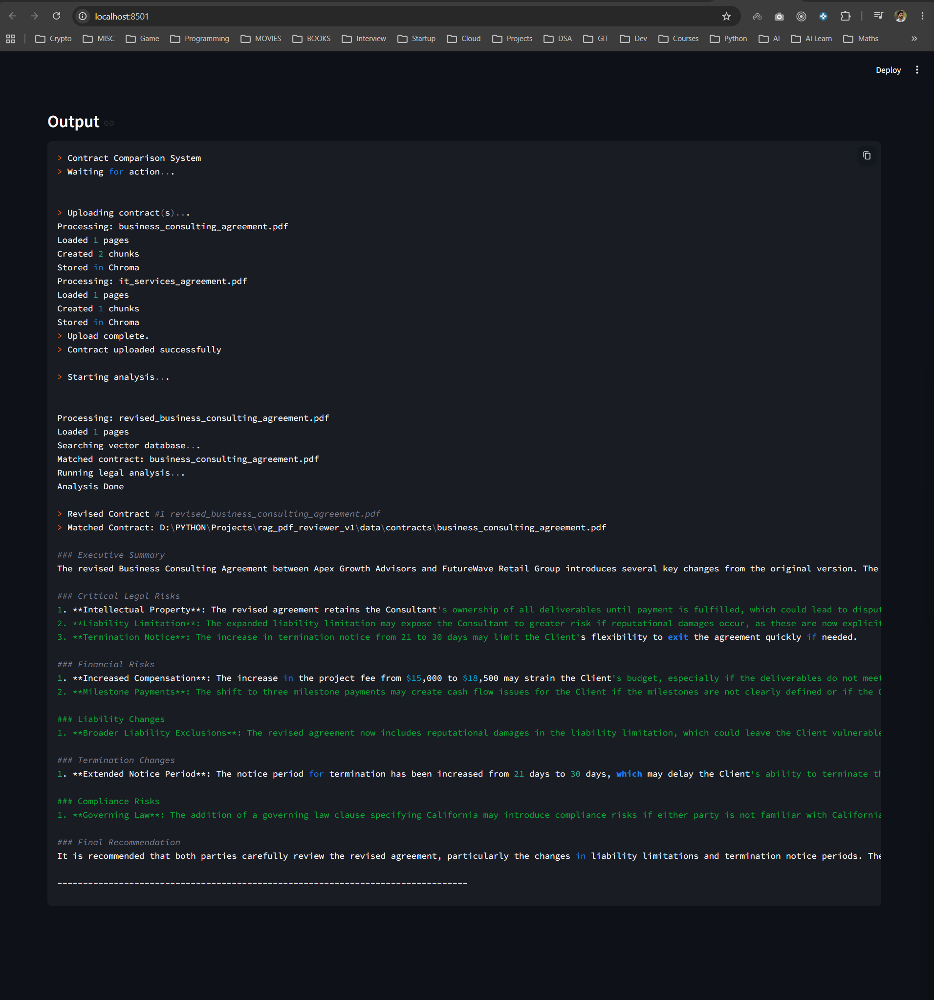

# RAG Legal Document Analyzer
A contract document comparison application that uses RAG (Retrieval-Augmented Generation) to analyze, compare, and review contract documents.

### How to run ? 
> backend/uvicorn main:app --reload

> frontend/streamlit run .\app.py

#### Get requirements.txt & Install dependencies
> pip freeze > requirements.txt

> pip install -r requirements.txt

### Functionalities

 * RAG
 * RAG Re-Ranking
 * Cosine similarity search
 * Langchain LCEL
 * FastAPI
 * Multiple document upload and save to dirctory
 * Streamlit UI

### Features
 * Upload and analyze contract documents
 * Compare original and revised contracts
 * Highlight changes between documents
 * RAG-powered contract review
 * Interactive Streamlit interface

 
<h2>Screenshots</h2>

  
  

  
  

  
  

